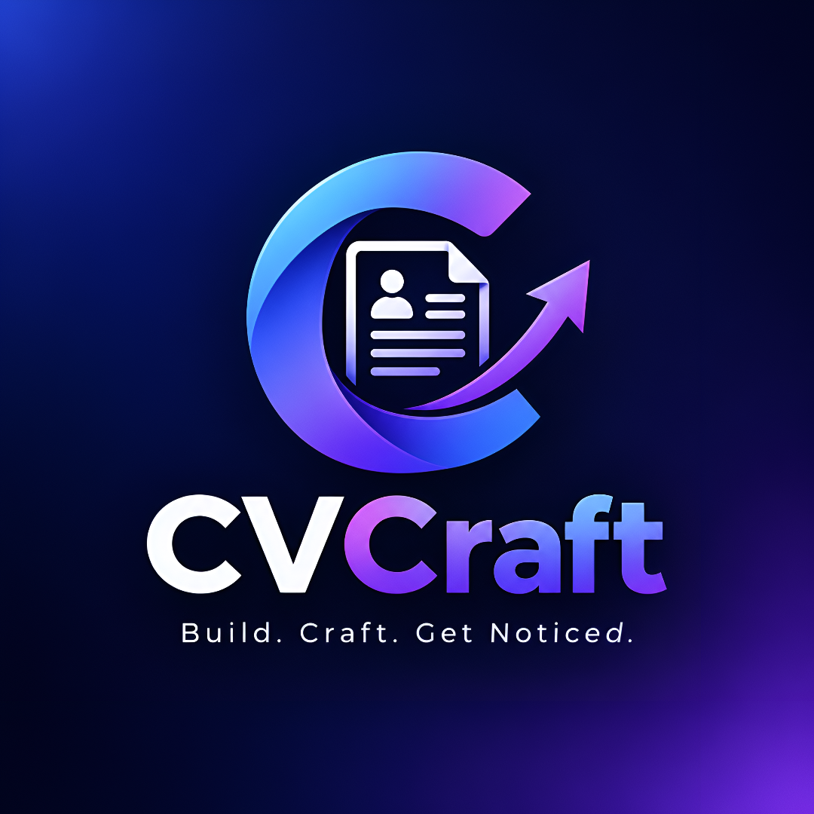

<p align="center">
  
</p>

<h1 align="center">CVCraft — Professional Desktop CV & Resume Workstation</h1>

<p align="center">
  <strong>Build. Craft. Get Noticed.</strong><br>
  <em>An offline-first, high-precision desktop workstation engineered for ambitious individuals to design, ATS-optimize, and export presentation-grade career documents.</em>
</p>

<p align="center">
  <a href="https://github.com/chathunga2007/CVCraft-CV-Genarator-App/releases"></a>
  <a href="https://www.python.org/"></a>
  <a href="https://www.riverbankcomputing.com/software/pyqt/"></a>
  <a href="LICENSE"></a>
  
  
</p>

---

## 🌟 Why CVCraft?

Most modern CV builders trap your private career data behind subscriptions, cloud servers, and rigid web forms. **CVCraft** is engineered differently: a **100% offline, zero-cloud desktop workstation** giving you pixel-perfect vector rendering, automated ATS keyword compliance, instant print-ready 300 DPI exports, and total ownership over your data.

Created and architected by **Chathunga Bimsara**, CVCraft combines enterprise-grade ReportLab vector typesetting with an intuitive, responsive PyQt6 interface.

---

## 🚀 Key Capabilities & Features

### 1. 📑 9 Tailored Architectural Templates
CVCraft features 9 handcrafted, distinct templates covering every career archetype:
- **Classic Sidebar (New):** Balanced 2-column layout with high-resolution circular photo header, clean vertical divider rule, categorized skill groups, and right-aligned timeline dates.
- **Modern Tech:** Dual-column layout featuring an accent sidebar for technical proficiencies and cloud stacks.
- **Minimalist Clean:** Sophisticated single-column hierarchy with airy typography, ideal for modern design and engineering.
- **Executive Leadership:** High-contrast header banner and strategic achievement highlights designed for senior leadership and management.
- **Corporate Professional:** Structured classic format with clean dividers, formal font pairings, and traditional balance.
- **Creative Designer:** Vibrant accent bars, visual skill pills, and dedicated portfolio highlights.
- **Software Engineer:** Technical layout with monospace accents, terminal-style headings, and direct repository links.
- **Academic & Research:** Strict academic single-column structure emphasizing education, publications, and grants.
- **ATS-Friendly Optimized:** 100% linear, single-column OCR-certified structure without tables or graphical traps, guaranteeing maximum parsing accuracy across Applicant Tracking Systems.

### 2. 👁️ Interactive High-Res Template Preview Modal
- **Full-Screen Live Inspection:** Inspect any template with sample or active data before applying.
- **Interactive Multi-Page Pagination:** Smoothly browse multi-page documents (`Page 1 of N`).
- **Dynamic Zoom Control:** Zoom smoothly from **40% to 160%** with a single click.
- **1-Click Switching:** Seamlessly navigate across templates with `◀ Previous` and `Next ▶` quick-switchers.

### 3. 🎯 "Tailor My CV" ATS Optimization Engine
- **Instant Job Description Parsing:** Paste any target job description directly into the ATS analyzer.
- **Match Score & Keyword Detection:** Calculates match percentages and extracts verified technical and soft skills.
- **Missing Keyword Radar:** Instantly flags critical keywords present in the job posting but missing from your CV.
- **1-Click Skill Injection:** Insert missing required skills into your document with a single button.

### 4. 🖼️ Vector PDF & 300 DPI High-Res Image Export
- **Pixel-Perfect Vector PDFs:** Scalable vector outputs with embedded fonts, crisp dividers, and exact A4 margins.
- **Print-Ready 300 DPI PNG Exports:** Generate ultra-sharp 2480x3508 px images ready for physical printing or social sharing.
- **4x Supersampled Profile Photos:** Profile pictures are processed with a 4x supersampled anti-aliased mask and LANCZOS downsampling for razor-sharp circular crops.

### 5. 💡 Offline-First AI Career Assistant
- **STAR-Method Experience Bullets:** Transforms raw job notes into structured **Situation, Task, Action, Result** impact statements.
- **Executive Summary Polisher:** Enhances tone, clarity, and authority without sending any data over the internet.
- **Role Skill Suggester:** Generates top industry competencies for any target role.
- **Strict User Consent:** AI suggestions are strictly previewed first; no changes are made without your explicit review.

### 6. 🪟 Native Windows 11 Taskbar & System Integration
- **Custom Windows AppUserModelID:** Properly decoupled from Python console windows.
- **Crisp Mipmapped Icon:** Dedicated 7-size Windows `.ico` (16, 24, 32, 48, 64, 128, 256 px) rendered across Taskbar, Alt-Tab, Titlebar, and Start Menu.
- **Native File Association:** Associates with `.cvcv` career document files for seamless double-click opening.

### 7. 🔒 Zero-Cloud Security & Lossless Portability
- **100% Local SQLite Persistence:** Your personal info, career history, and profile photos never leave your machine (`data/cvcraft.db`).
- **Lossless Document Exchange:** Save and share standalone `.cvcv` document archives.
- **1-Click Full System Backup:** Export complete portable `.zip` archives containing your database, photos, and configurations.

---

## 📥 Installation & Download

### Method 1: Windows 1-Click Installer (Recommended)
Download the official Windows installer created with Inno Setup:
1. Go to the [Releases](https://github.com/chathunga2007/CVCraft-CV-Genarator-App/releases) page.
2. Download **`CVCraft_Setup_v1.0.0.exe`**.
3. Run the installer and click **Next ➔ Next ➔ Install**.
4. Launch CVCraft directly from your Desktop or Start Menu!

### Method 2: Standalone Portable Executable
1. Download `CVCraft.exe` from the latest release.
2. Double-click **`CVCraft.exe`** to launch instantly with zero installation required.

### Method 3: Run from Source (Developers)

```bash
# 1. Clone the repository
git clone https://github.com/chathunga2007/CVCraft-CV-Genarator-App.git
cd CVCraft-CV-Genarator-App

# 2. (Optional) Create a virtual environment
python -m venv venv
venv\Scripts\activate   # On Windows
# source venv/bin/activate # On macOS/Linux

# 3. Install dependencies
pip install -r requirements.txt

# 4. Launch CVCraft
python main.py
```

---

## ⌨️ Productivity Keyboard Shortcuts

| Shortcut | Action |
|:---|:---|
| <kbd>Ctrl</kbd> + <kbd>N</kbd> | Create New CV |
| <kbd>Ctrl</kbd> + <kbd>S</kbd> | Save Active CV |
| <kbd>Ctrl</kbd> + <kbd>E</kbd> | Quick Export PDF |
| <kbd>Ctrl</kbd> + <kbd>Z</kbd> | Undo Edit |
| <kbd>Ctrl</kbd> + <kbd>Y</kbd> | Redo Edit |
| <kbd>Ctrl</kbd> + <kbd>P</kbd> | Open Live Template Preview Dialog |

---

## 🏗️ Architecture & Technology Stack

```
┌─────────────────────────────────────────────────────────────┐
│                       PyQt6 Desktop Shell                   │
│   (Main Window, Custom Dark/Light Theme Engine, Toast UX)   │
└──────────────────────────────┬──────────────────────────────┘
                               │
       ┌───────────────────────┴───────────────────────┐
       ▼                                               ▼
┌─────────────────────────────┐         ┌─────────────────────────────┐
│       UI Views & Dialogs    │         │    Live Canvas Engine       │
│  - WorkspaceView (3-Column) │         │  - PyMuPDF Vector Renderer  │
│  - TemplatePreviewDialog    │◄───────►│  - Debounced Multi-Page UI  │
│  - JobMatchView (ATS)       │         │  - Dynamic 40%-160% Zoom    │
│  - Dashboard & MyCVs Views  │         └─────────────────────────────┘
└──────────────┬──────────────┘
               ▼
┌─────────────────────────────────────────────────────────────┐
│                      Service Layer                          │
│  - PDFService (ReportLab Vector PDF & 300 DPI PNG Engine)   │
│  - ATSService (Keyword Matching & Structural Scoring)       │
│  - AIService (STAR Bullet Optimization & Local Heuristics)  │
│  - ImportExportService (Lossless .cvcv & System Zip Backup) │
└──────────────┬──────────────────────────────────────────────┘
               ▼
┌─────────────────────────────────────────────────────────────┐
│                    Persistence & Storage                    │
│   - SQLite3 Database (data/cvcraft.db)                      │
│   - Local High-Res Photo Storage (data/photos/)             │
│   - Windows COM IPropertyStore Taskbar Integration          │
└─────────────────────────────────────────────────────────────┘
```

---

## 👨‍💻 Lead Architect & Developer

<table>
  <tr>
    <td align="center">
      <a href="https://github.com/chathunga2007">
        <br />
        <sub><b>Chathunga Bimsara</b></sub>
      </a><br />
      <sub>Lead Architect & Creator</sub>
    </td>
    <td>
      <strong>Chathunga Bimsara</strong> engineered and designed CVCraft to give professionals worldwide a powerful, beautiful, and private desktop workstation for resume craftsmanship.<br><br>
      🌐 <strong>GitHub:</strong> <a href="https://github.com/chathunga2007">@chathunga2007</a><br>
      📦 <strong>Repository:</strong> <a href="https://github.com/chathunga2007/CVCraft-CV-Genarator-App">chathunga2007/CVCraft-CV-Genarator-App</a>
    </td>
  </tr>
</table>

---

## 🤝 Contributing

Contributions, issues, and feature requests are welcome!
Feel free to check the [issues page](https://github.com/chathunga2007/CVCraft-CV-Genarator-App/issues).

1. Fork the Project
2. Create your Feature Branch (`git checkout -b feature/AmazingFeature`)
3. Commit your Changes (`git commit -m 'Add some AmazingFeature'`)
4. Push to the Branch (`git push origin feature/AmazingFeature`)
5. Open a Pull Request

---

## 📄 License

Distributed under the **MIT License**. See [`LICENSE`](LICENSE) for more information.

---

<p align="center">
  Crafted with ❤️ by <strong>Chathunga Bimsara</strong><br>
  <strong>CVCraft</strong> — <em>Build. Craft. Get Noticed.</em>
</p>
